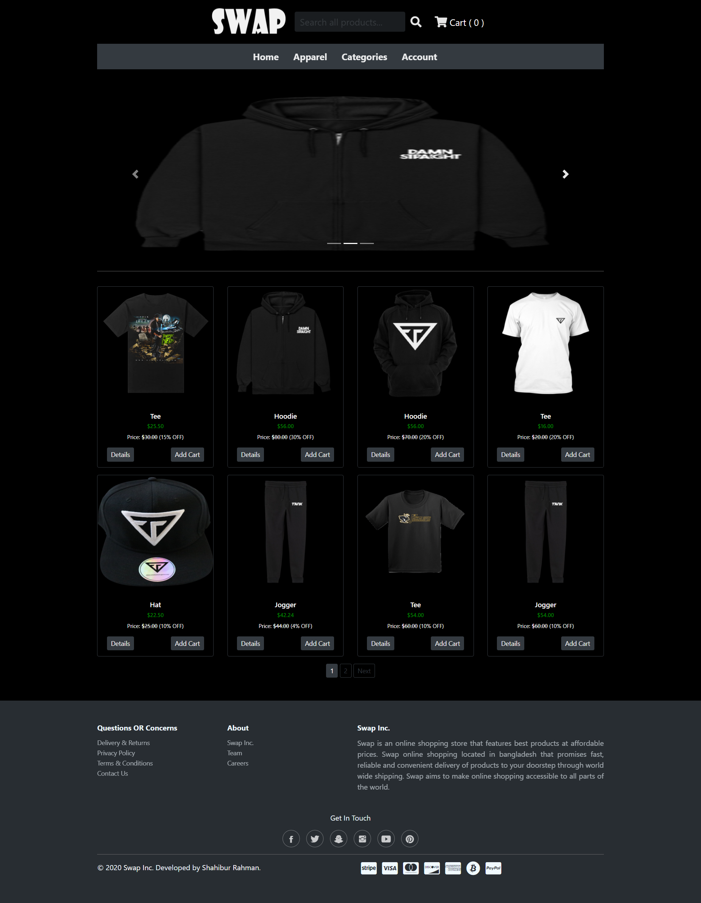
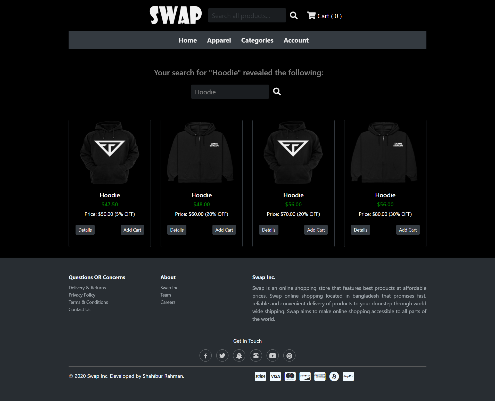
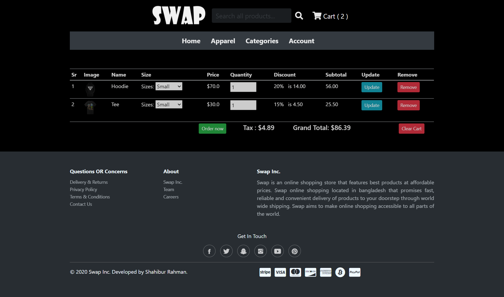
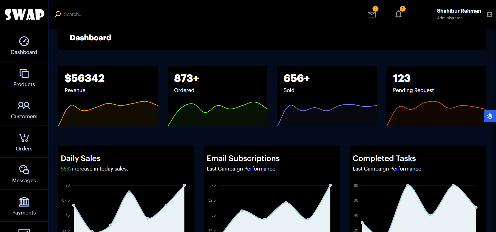
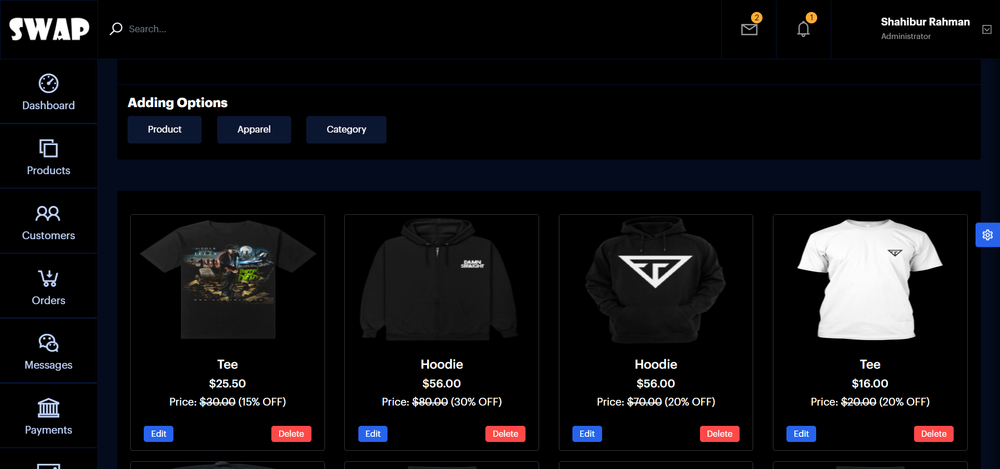
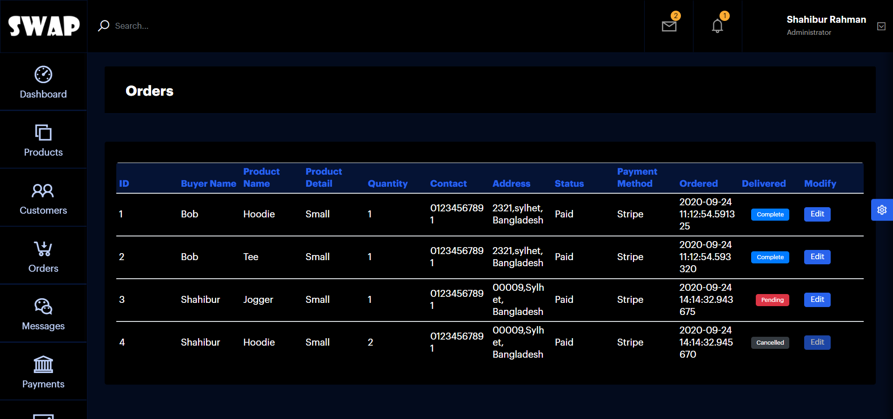
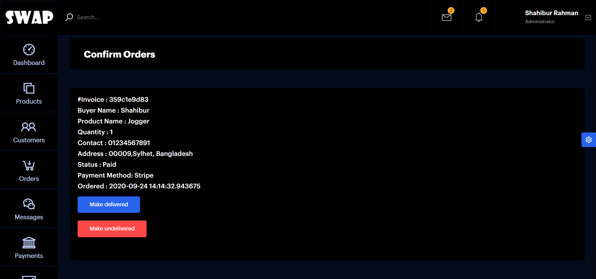
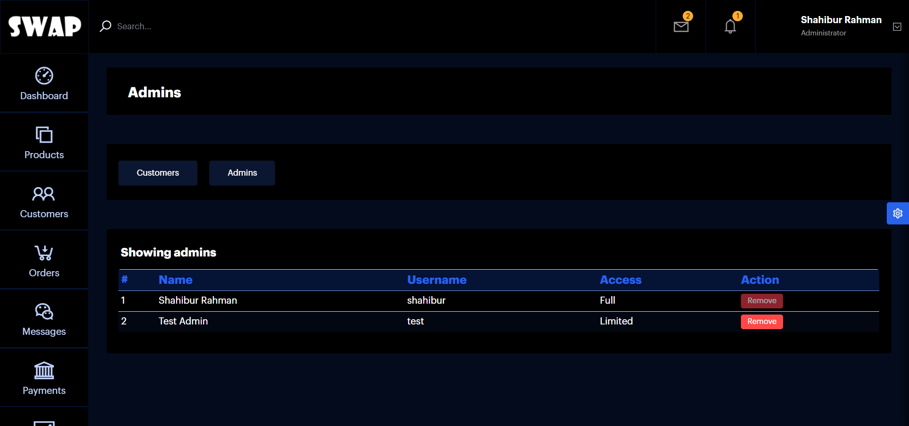

# Swap Ecommerce Flask

## Ecommerce Web Application using Python and Flask (For Learning Purpose)

This project is a sample Ecommerce web application developed for learning purposes, using the Python programming language and Flask web framework.

## Features

- **Database:** SQLAlchemy is used for managing the database. The database schema and models can be found in the `models` directory.

- **Payment Gateway:** Stripe is integrated into the application for handling online payments. Ensure you have the necessary API keys and configurations in the `config.py` file.

- **Email:** Flask-Mail is used for sending emails. Configure your email settings in the `config.py` file to enable features like order confirmation emails.

### Features

1. Fully Functional Dashboard (user and admin)
2. Fully Responsive
3. Account Managements (user and admin)
4. Cart Managements
5. Mail Verifications
6. Stripe Payment Gateway
7. More....


### Demo 

YouTube : https://youtu.be/wgJmhHc3aTc


### ScreenShot

<table align="center">
    <tr>
        <td align="center">
         <p>Home Page</p>
           
        </td>
        <td align="center">
        <p>Search Results</p>
         
        </td>
    </tr>
    <tr>
        <td align="center">
           <p>Order Page</p>
           
        </td>
	 <td align="center">
        	         <p>Admin Dashboard</p>
                
        </td>
    </tr>
    <tr>
        <td align="center">
        	         <p>Dashboard Products</p>
                
        </td>
        <td align="center">
        	         <p>Dashboard Orders</p>
                
        </td>
    </tr>
    <tr>
        <td align="center">
        	         <p>Confirm Order</p>
                
        </td>
        <td align="center">
        	         <p>Dashboard Users</p>
                
        </td>
    </tr>
</table>

## Usage

1. Requirements

    * <strong>Python</strong> (version 3.0 or above)

2. Installation
```  
    pip install -r requirements.txt
```

3. Setup
	
```
  Mail Configuration : 
  
      MAIL_SERVER=''   # mail server 
      MAIL_USERNAME='' # mail server username
      MAIL_PASSWORD='' # mail server password
      MAIL_PORT=465
      MAIL_USE_SSL=True
      MAIL_USE_TLS=False    
```

```
  Stripe Configuration : 
  
      publishable_key='' # stripe publishable key
      stripe.api_key=''  # stripe api key
```

4. Running
```
     python run.py
```
<hr>

<table align="center">
    <tr>
        <td align="center">
		<!-- <p>Project source code has been removed, for source code contact me via email.</p> -->
        </td>
    </tr>
</table>


